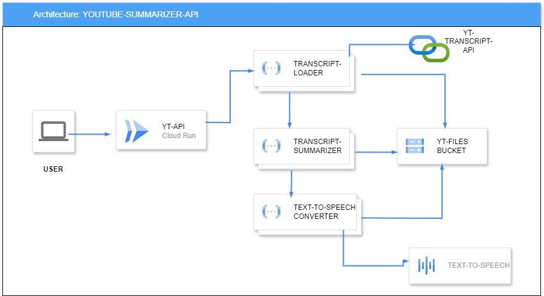

# YOUTUBE VIDEO SUMMARIZER-TO TEXT 
### THIS IS A SIMPLE SERVERLESS WEBSITE-API WHICH TAKES AN YOUTUBE VIDEO URL AND CONVERTS THE SUMMARISED TRANSCRIPTS INTO AUDIO_FILE 
### ARCHITECTURE DIAGRAM:-

### PROJECT OBJECTIVE:
#### As we all know listening to long duration youtube videos or podcasts  are really boring.so that i have designed a website which summarises the youtube video by loading its trascripts and converts into speech  and generates a qrcode for user to download the audio
### PROJECT ARCHITECTURE OVERVIEW :
   #### CLOUD RUN (yt-api):
**CLOUD RUN** serves as a frontend for users to paste the video-url they want to summarize .This sends a process request  to **transcript_loader** cloud function and in return receives a audio_url and generates **qr code** for audio_url and renders that to user to download the audio
   #### CLOUD FUNCTIONS: 
   1) **transcript_loader**:  This get invoked by Cloud Run service yt-api by sending a param videoUrl .then  it extracts the transcript  of yt video using yt api  and stores it in a google cloud storage bucket and sends the object path to transcript_summarizer

   2) **transcript_summarizer**:   when transcript loader sends a objectpath to this service .it summarises it using **vertex ai gemini-llm model** and sends the summarised text to text-to-speech-converter

   3) **text-to-speech-converter**: when transcript summarizer sends the summarised text to this service.it converts to speech using **google text-to-speech api** and stores it in cloud storage and sends the url of it as a response to request

### PROJECT SETUP:-
###### First clone this  repo to your local workstation
```bash
git clone 
```

###### Replace the following with your PROJECT_ID
```bash
export PROJECT_ID="REPLACE_WITH_YOUR_PROJECT_ID"
gcloud config set project $PROJECT_ID
```
###### enable all required apis
```bash
gcloud services enable run.googleapis.com \
cloudbuild.googleapis.com cloudfunctions.googleapis.com \
texttospeech.googleapis.com artifactregistry.googleapis.com  aiplatform.googleapis.com
```
###### creating required serviceaccounts 
```bash
gcloud iam service-accounts create transcript-loader 
gcloud iam service-accounts create transcript-summarizer
gcloud iam service-accounts create text-to-speech-converter
gcloud iam service-accounts create yt-api 
```

###### ADDING PROJECT LEVEL IAM-BINDINGS TO SERVICE-ACCOUNTS

```bash
gcloud projects add-iam-policy-binding $PROJECT_ID \
--member "serviceAccount:transcript-loader@${PROJECT_ID}.iam.gserviceaccount.com" \
--role roles/storage.admin
gcloud projects add-iam-policy-binding $PROJECT_ID \
--member "serviceAccount:transcript-summarizer@${PROJECT_ID}.iam.gserviceaccount.com" \
--role roles/storage.admin
gcloud projects add-iam-policy-binding $PROJECT_ID \
--member "serviceAccount:text-to-speech-converter@${PROJECT_ID}.iam.gserviceaccount.com" \
--role roles/storage.admin
gcloud projects add-iam-policy-binding $PROJECT_ID \
--member "serviceAccount:transcript-summarizer@${PROJECT_ID}.iam.gserviceaccount.com" \
--role roles/aiplatform.user
```
###### creating a cloud storage bucket to store transcripts and audio files
```bash
export BUCKET_NAME_SUFFIX="REPLACE WITH YOUR SUFFIX"
BUCKET_NAME="yt-gkem-${BUCKET_NAME_SUFFIX}"
gsutil mb -l asia-south2 gs://$BUCKET_NAME
```
###### making the cloud storage public 
```bash
gsutil iam ch allUsers:objectViewer gs://yt-gkem-deploy
```
######
###### Now it's time to create cloud functions 
```bash
cd cloud-functions/text-to-speech-converter
gcloud functions  deploy text-to-speech-converter \
--entry-point convert_to_speech --runtime python312 \
--gen2 --trigger-http --no-allow-unauthenticated  \
--service-account text-to-speech-converter@${PROJECT_ID}.iam.gserviceaccount.com --timeout 500s \
--set-env-vars GOOGLE_CLOUD_STORAGE_BUCKET_NAME=${BUCKET_NAME} \
--source . --region asia-south2

export CONVERTER_URL=$(gcloud functions describe text-to-speech-converter --region asia-south2 --format "value(url)")
cd ../transcript-summarizer 
gcloud functions deploy transcript-summarizer \
--entry-point summarize_transcript --runtime python312 --trigger-http --gen2 \
--service-account transcript-summarizer@${PROJECT_ID}.iam.gserviceaccount.com \
--timeout 500s --memory 1024M --cpu 1  --no-allow-unauthenticated --source . \
--region asia-south2 \
--set-env-vars GOOGLE_CLOUD_STORAGE_BUCKET_NAME=$BUCKET_NAME,VERTEX_AI_LOCATION=northamerica-northeast1,TEXT_TO_SPEECH_CONVERTER_FUNCTION_URL=$CONVERTER_URL
export SUMMARIZER_URL=$(gcloud functions describe transcript-summarizer --region asia-south2 --format "value(url)")
cd ../transcript-loader
gcloud functions deploy transcript-loader \
--entry-point load_transcript --runtime python312 --trigger-http --gen2 \
--service-account transcript-loader@${PROJECT_ID}.iam.gserviceaccount.com \
--timeout 500s --no-allow-unauthenticated --source . \
--region asia-south2 \
--set-env-vars GOOGLE_CLOUD_STORAGE_BUCKET_NAME=$BUCKET_NAME,TRANSCRIPT_SUMMARIZER_FUNCTION_URL=$SUMMARIZER_URL
export LOADER_FUNCTION_URL=$(gcloud functions describe transcript-loader --region asia-south2 --format "value(url)")
```
###### now its time to add  run-invoker policy bindings to service accounts
```bash
gcloud functions add-invoker-policy-binding text-to-speech-converter \
      --region="asia-south2" \
      --member="serviceAccount:transcript-summarizer@${PROJECT_ID}.iam.gserviceaccount.com"
gcloud functions add-invoker-policy-binding transcript-summarizer \
      --region="asia-south2" \
      --member="serviceAccount:transcript-loader@${PROJECT_ID}.iam.gserviceaccount.com"
gcloud functions add-invoker-policy-binding transcript-loader \
      --region="asia-south2" \
      --member="serviceAccount:yt-api@${PROJECT_ID}.iam.gserviceaccount.com"
      
```
### Now final  step to deploy our cloud run service which acts as a frontend to our api
```bash
cd ../../app
gcloud  run deploy yt-summarizer-api --region asia-south2  --port 8080 \
--service-account yt-api@${PROJECT_ID}.iam.gserviceaccount.com \
--set-env-vars CONVERTER_URL=$LOADER_FUNCTION_URL --source . --allow-unauthenticated
```
### NOW PROJECT DEPLOYMENT PART COMPLETED NOW ITS TIME TO FEEL THIS PROJECT  CLICK BELOW LINK TO HEAD TO WEBPAGE
```bash
gcloud run services describe yt-summarizer-api  --region asia-south2 --format json|jq -r .status.address.url
```